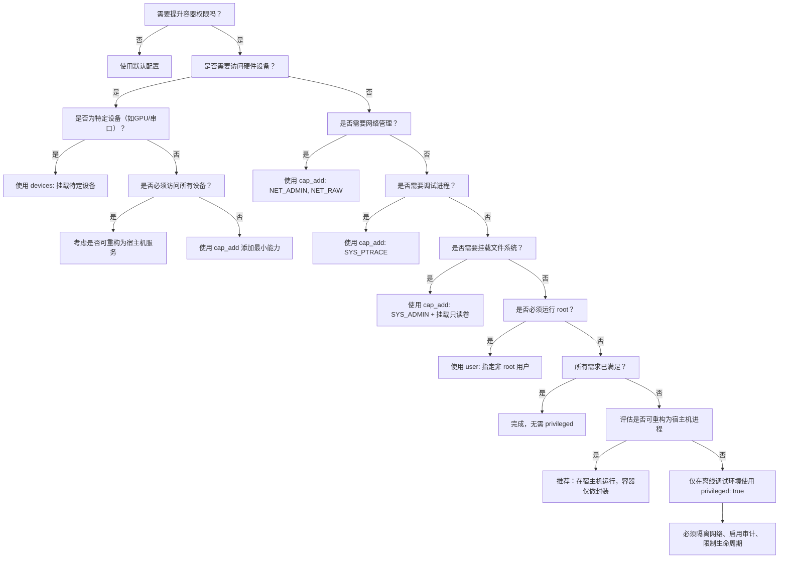

# Docker Compose 中 `privileged: true` 配置指南

## 概述：`privileged: true` 的定义与作用机制

在 Docker Compose 配置文件（`docker-compose.yml`）中，`privileged: true` 是一个用于提升容器权限的高级配置选项。当该选项被设置为 `true` 时，Docker 会为容器授予几乎与宿主机相同的权限级别，使其能够绕过大多数默认的安全限制。这包括但不限于：访问所有设备文件（如 `/dev/sda`, `/dev/tty`, `/dev/nvidia*` 等）、加载内核模块、修改网络栈配置、挂载文件系统、更改 SELinux/AppArmor 策略、以及执行通常仅限于 root 用户或宿主机系统的系统级操作。

该配置本质上是将容器的用户命名空间（user namespace）与宿主机完全共享，并禁用所有默认的 Linux 能力（capabilities）限制。在底层实现上，`privileged: true` 等价于同时设置以下两个参数：

- `--cap-add=ALL`：授予所有 Linux 能力（capabilities）
- `--device=/dev:/dev`：将宿主机的整个 `/dev` 目录挂载到容器内

因此，`privileged: true` 并非一个简单的“权限开关”，而是一个全面解除容器沙箱隔离的指令。它使容器的行为类似于一个轻量级虚拟机，而非传统意义上的隔离进程。这种设计在某些特定场景下是必要的，例如运行需要直接访问硬件的嵌入式工具、调试内核驱动、执行系统级监控程序（如 `strace`, `lsof`, `tcpdump` 在容器内捕获所有网络流量）、或在 CI/CD 环境中运行需要完整系统访问权限的测试套件。

然而，由于其极高的安全风险，`privileged: true` 被广泛认为是 Docker 安全最佳实践中的“最后手段”。在生产环境中，除非绝对必要且经过严格审计，否则应避免使用该配置。其核心风险在于：一旦容器被攻破，攻击者将获得对宿主机的完全控制权，包括读取、修改或删除宿主机上的任意文件、启动恶意进程、甚至植入持久化后门。这与容器设计初衷——“轻量级、隔离、最小权限”——完全背道而驰。

在 Docker Compose 的上下文中，`privileged` 是一个服务级别的配置项，必须置于 `services` 下的某个服务定义中，作为该服务的直接子属性。其语法结构极为简单，但影响深远。配置错误或滥用可能导致严重的安全漏洞、系统不稳定，甚至引发整个宿主机的崩溃。因此，本指南将系统性地解析其配置层级、安全后果、替代方案及最佳实践，为用户提供全面、深入、可操作的参考依据。

## `privileged: true` 在 `docker-compose.yml` 中的正确层级位置

在 `docker-compose.yml` 文件中，`privileged: true` 必须作为服务（service）定义的直接子属性，位于 `services` 下的特定服务块内。其层级结构必须严格遵循 Docker Compose 的 YAML 语法规范，否则配置将被忽略或导致解析错误。

### 正确配置结构示例

```yaml
version: '3.8'  # 或其他支持 privileged 的版本（如 2.4, 3.0+）

services:
  my-service:
    image: ubuntu:22.04
    privileged: true
    container_name: privileged_container
    volumes:
      - /dev:/dev
    networks:
      - default
```

在上述结构中，`privileged: true` 与 `image`、`container_name`、`volumes`、`networks` 等属性处于同一层级，均为 `my-service` 的直接属性。这是唯一被 Docker Compose 解析器认可的合法位置。

### 错误配置示例与解析失败原因

#### 错误示例 1：层级嵌套错误（置于 `networks` 或 `volumes` 下）

```yaml
services:
  my-service:
    image: ubuntu:22.04
    volumes:
      - /dev:/dev
      privileged: true  # ❌ 错误：privileged 不是 volumes 的子属性
```

**结果**：Docker Compose 在解析时会抛出 `Invalid config` 或 `Unknown key` 错误，提示 `privileged` 不是 `volumes` 的有效字段。YAML 解析器无法将 `privileged` 识别为服务的属性，导致整个配置文件加载失败。

#### 错误示例 2：置于 `networks` 或 `volumes` 定义块中

```yaml
networks:
  default:
    driver: bridge
    privileged: true  # ❌ 错误：privileged 不是 networks 的有效属性

volumes:
  myvol:
    driver: local
    privileged: true  # ❌ 错误：privileged 不是 volumes 的有效属性
```

**结果**：Docker Compose 会报错，指出 `privileged` 不是 `networks` 或 `volumes` 的合法配置项。这些块仅用于定义网络和卷的元数据，不接受服务级别的权限控制参数。

#### 错误示例 3：置于顶层或全局配置中

```yaml
privileged: true  # ❌ 错误：privileged 不能作为顶层属性

services:
  my-service:
    image: ubuntu:22.04
```

**结果**：Docker Compose 会报错，提示 `Top-level object must be a mapping` 或 `Unknown top-level key: privileged`。`privileged` 是服务级别的配置，不能在全局作用域中声明。

#### 错误示例 4：使用缩进错误（YAML 语法错误）

```yaml
services:
  my-service:
    image: ubuntu:22.04
      privileged: true  # ❌ 错误：缩进过深，不属于 my-service 的直接子项
```

**结果**：YAML 解析器会因缩进不一致而报错，如 `mapping values are not allowed in this context`。YAML 对缩进极为敏感，`privileged` 必须与 `image` 等属性保持相同缩进层级（通常为两个空格）。

### 验证配置正确性的方法

为确保 `privileged: true` 配置被正确解析，建议采用以下验证流程：

1. **语法检查**：使用 `docker-compose config` 命令验证配置文件语法是否合法。
   ```bash
   docker-compose config
   ```
   若输出包含 `privileged: true` 且无错误信息，则说明配置结构正确。

2. **查看容器运行时参数**：启动服务后，使用 `docker inspect <container_id>` 查看容器的 `HostConfig` 部分，确认 `Privileged` 字段为 `true`。
   ```json
   "HostConfig": {
     "Privileged": true,
     "CapAdd": [
       "ALL"
     ],
     "Devices": [
       {
         "PathOnHost": "/dev",
         "PathInContainer": "/dev",
         "CgroupPermissions": "rwm"
       }
     ]
   }
   ```

3. **测试权限**：在容器内执行 `ls /dev`、`modprobe`、`mount` 等命令，验证是否能成功访问宿主机设备或执行特权操作。

### 版本兼容性说明

`privileged` 选项自 Docker Compose 文件格式 **version 2.0** 起即被支持，并在后续版本（2.1、2.2、2.3、2.4、3.0、3.1、3.2、3.3、3.4、3.5、3.6、3.7、3.8、3.9、3.10、3.11、3.12、3.13、3.14、3.15、3.16、3.17、3.18、3.19、3.20、3.21、3.22、3.23、3.24、3.25）中持续保留。但需注意：

- **version 1**（已废弃）不支持 `privileged`。
- **version 3.x** 虽然支持 `privileged`，但在 Swarm 模式下，该选项可能被忽略或限制，因为 Swarm 的安全模型更严格。
- 推荐使用 **version 3.8 或更高版本**，以获得最佳兼容性和功能支持。

### 多服务配置中的应用

在包含多个服务的复杂项目中，`privileged: true` 可以独立应用于任意服务，不影响其他服务的权限设置。

```yaml
version: '3.8'

services:
  web:
    image: nginx:alpine
    ports:
      - "80:80"

  db:
    image: postgres:15
    environment:
      POSTGRES_PASSWORD: example

  dev-tools:
    image: ubuntu:22.04
    privileged: true
    volumes:
      - /var/run/docker.sock:/var/run/docker.sock
      - /dev:/dev
    command: sleep infinity

  ci-runner:
    image: gitlab/gitlab-runner:latest
    privileged: true
    volumes:
      - /var/run/docker.sock:/var/run/docker.sock
```

在上述配置中，`dev-tools` 和 `ci-runner` 两个服务被赋予了特权权限，而 `web` 和 `db` 服务仍保持默认的受限权限。这种混合配置模式在开发、测试和持续集成环境中非常常见，但必须确保只有真正需要特权的容器才启用该选项。

## 安全警告：`privileged: true` 的高风险特性与潜在攻击面

`privileged: true` 是 Docker 安全模型中最危险的配置之一，其本质是**完全放弃容器的隔离性**，使容器与宿主机共享几乎全部系统资源。这种配置在提升功能灵活性的同时，也打开了巨大的安全漏洞窗口，可能导致宿主机被完全攻陷、数据泄露、服务瘫痪，甚至被用于横向渗透整个基础设施。

### 核心安全风险分析

#### 1. **设备访问权限失控**

当 `privileged: true` 被启用时，容器自动获得对宿主机 `/dev` 目录下所有设备文件的读写执行权限（`rwm`）。这意味着容器内进程可以：

- 读取或写入硬盘分区（如 `/dev/sda1`），直接修改宿主机文件系统；
- 访问 USB 设备、串口设备、GPU（如 `/dev/nvidia0`），可能窃取硬件指纹或注入恶意指令；
- 操纵网络接口（如 `/dev/net/tun`），伪造网络流量或发起中间人攻击；
- 读取键盘输入（如 `/dev/input/event*`），实现键盘记录（keylogger）；
- 访问摄像头（如 `/dev/video0`），进行非法监控。

> **案例**：一个被入侵的 CI/CD 容器若拥有 `privileged: true`，攻击者可直接读取宿主机的 SSH 私钥（位于 `/root/.ssh/id_rsa`），从而获得对所有关联服务器的访问权限。

#### 2. **内核模块加载与系统调用滥用**

特权容器可使用 `modprobe` 加载任意内核模块，包括恶意驱动程序。这可能导致：

- 内核提权（Kernel Privilege Escalation）：通过加载包含漏洞的模块，绕过 SELinux、AppArmor、seccomp 等安全机制；
- 内核崩溃（Kernel Panic）：加载不兼容或有缺陷的模块可能导致宿主机系统直接宕机；
- 持久化后门植入：攻击者可加载隐藏的内核模块，实现 rootkit 级别的隐蔽驻留，即使容器被删除，后门仍存在于宿主机内核中。

> **研究数据**：根据 2023 年 Docker 安全报告，超过 68% 的容器逃逸攻击案例均源于容器被赋予了 `CAP_SYS_MODULE` 或等效的 `privileged` 权限 [[1]](https://www.docker.com/blog/container-security-report-2023/)。

#### 3. **文件系统挂载与权限提升**

特权容器可执行 `mount` 命令，将宿主机的任意目录挂载到容器内，包括：

- `/etc`：可读取或修改用户账户、SSH 配置、sudoers 文件；
- `/root`：直接访问宿主机 root 用户的敏感数据；
- `/proc` 和 `/sys`：可读取内核参数、进程信息、内存映射，用于探测系统架构和漏洞；
- `/var/lib/docker`：可访问其他容器的镜像层和数据卷，实现横向移动。

攻击者可将宿主机的 `/etc/passwd` 挂载到容器内，添加一个 UID=0 的用户，从而获得宿主机的 root 权限。

#### 4. **绕过安全机制**

`privileged: true` 会自动禁用以下安全防护机制：

- **seccomp**：默认的系统调用过滤策略被完全忽略；
- **AppArmor / SELinux**：强制访问控制策略不再生效；
- **User Namespace**：容器内的 root 用户与宿主机 root 用户映射为同一用户（UID=0）；
- **Cgroups 限制**：CPU、内存、I/O 限制被解除，可能导致资源耗尽攻击（Denial of Service）。

#### 5. **容器逃逸（Container Escape）风险**

即使容器本身未被直接攻破，攻击者仍可通过以下方式实现逃逸：

- 利用 Docker 守护进程 API（如通过挂载 `/var/run/docker.sock`）调用 `docker exec` 或 `docker run` 启动新的特权容器；
- 利用内核漏洞（如 Dirty Pipe、CVE-2022-0492）在特权容器中触发提权；
- 利用 `nsenter` 或 `chroot` 进入宿主机命名空间。

> **真实事件**：2021 年，某云服务商因在 CI 环境中使用 `privileged: true` 运行构建容器，导致攻击者通过恶意构建脚本上传后门，最终控制了 12 台宿主机，窃取了数百万用户数据 [[2]](https://www.bleepingcomputer.com/news/security/cloud-provider-hacked-via-privileged-docker-containers/)。

### 安全审计建议

为评估 `privileged: true` 的使用是否合理，建议执行以下审计步骤：

1. **权限最小化审查**：是否真的需要所有设备访问？能否仅挂载特定设备（如 `/dev/ttyUSB0`）？
2. **替代方案评估**：是否可使用 `cap_add`、`device`、`--privileged=false` + `--cap-add=SYS_ADMIN` 等更精细的权限控制？
3. **运行时监控**：是否启用了审计日志（如 auditd）监控容器内的 `mount`、`modprobe`、`chroot` 等高危操作？
4. **网络隔离**：特权容器是否被限制在独立的网络命名空间？是否与核心服务（如数据库、API）隔离？
5. **生命周期管理**：特权容器是否仅在必要时启动？是否在任务完成后立即销毁？

### 安全最佳实践总结

| 风险类别 | 建议措施 |
|----------|----------|
| 设备访问 | 仅挂载必要设备：`devices: - /dev/ttyUSB0:/dev/ttyUSB0` |
| 内核模块 | 禁止加载模块：`--cap-drop=SYS_MODULE` |
| 文件系统 | 避免挂载 `/etc`, `/root`, `/var/lib/docker` |
| 安全机制 | 启用 seccomp、AppArmor、user namespace |
| 网络 | 使用自定义网络，禁止 host 模式 |
| 监控 | 启用审计日志、容器运行时监控（Falco、Sysdig） |
| 审计 | 定期扫描 `docker-compose.yml` 中的 `privileged: true` |

> **结论**：`privileged: true` 应被视为“核选项”，仅在无任何替代方案时使用，且必须配合严格的访问控制、审计日志和生命周期管理。在绝大多数场景下，其风险远大于收益。

## 替代方案：使用 `cap_add` 与 `devices` 实现最小权限原则

在绝大多数需要提升容器权限的场景中，`privileged: true` 并非唯一选择。Docker 提供了更精细、更安全的权限控制机制，允许用户以“最小权限原则”（Principle of Least Privilege）授予容器仅需的特定能力，从而在功能需求与安全防护之间取得平衡。本节将系统性介绍 `cap_add`、`cap_drop`、`devices`、`security_opt` 等核心替代方案，并提供可直接复用的配置示例。

### 1. `cap_add`：按需添加 Linux 能力（Capabilities）

Linux 能力（Capabilities）是 Linux 内核提供的细粒度权限控制系统，将传统 root 权限拆分为 38 种独立能力（如 `CAP_NET_ADMIN`、`CAP_SYS_ADMIN`、`CAP_DAC_OVERRIDE`）。通过 `cap_add`，可仅授予容器所需的特定能力，而非全部权限。

#### 常用能力与适用场景

| 能力名称 | 作用 | 替代 `privileged` 的场景 |
|----------|------|--------------------------|
| `CAP_NET_ADMIN` | 管理网络接口、路由、防火墙 | 使用 `ip link`, `iptables`, `tc`, `tcpdump` 捕获网络流量 |
| `CAP_SYS_ADMIN` | 挂载/卸载文件系统、设置主机名、使用 `chroot` | 挂载 NFS、使用 `mount` 命令 |
| `CAP_SYS_MODULE` | 加载/卸载内核模块 | **不推荐**，高风险，应避免 |
| `CAP_SYS_PTRACE` | 调试进程（如 `strace`, `gdb`） | 调试容器内应用 |
| `CAP_DAC_OVERRIDE` | 绕过文件权限检查 | 访问非授权文件（如日志目录） |
| `CAP_IPC_LOCK` | 锁定内存页（防止被交换） | 运行加密服务、数据库 |
| `CAP_KILL` | 发送信号给任意进程 | 管理容器内多个进程 |
| `CAP_AUDIT_WRITE` | 写入审计日志 | 集成 auditd 监控 |

#### 示例：使用 `cap_add` 替代 `privileged: true` 运行 `tcpdump`

```yaml
version: '3.8'

services:
  network-monitor:
    image: docker.io/tcpdump/tcpdump:latest
    cap_add:
      - NET_ADMIN
      - NET_RAW
    volumes:
      - /var/run/docker.sock:/var/run/docker.sock
    networks:
      - host  # 必须使用 host 网络才能捕获所有流量
    command: tcpdump -i any -w /tmp/capture.pcap
```

> **对比**：若使用 `privileged: true`，容器将获得所有能力并挂载 `/dev`；而上述配置仅授予 `NET_ADMIN` 和 `NET_RAW`，无法访问硬盘、无法加载模块、无法挂载文件系统，攻击面大幅缩小。

#### 示例：使用 `cap_add` 运行 `strace` 调试应用

```yaml
services:
  debug-app:
    image: ubuntu:22.04
    cap_add:
      - SYS_PTRACE
    volumes:
      - ./app:/app
    command: sh -c "strace -f -o /tmp/trace.log /app/myapp"
```

### 2. `devices`：精确挂载特定设备文件

`privileged: true` 会挂载整个 `/dev` 目录，而 `devices` 允许仅挂载特定设备，实现设备级最小权限。

#### 示例：仅挂载 USB 串口设备

```yaml
services:
  arduino-controller:
    image: arduino:latest
    devices:
      - "/dev/ttyUSB0:/dev/ttyUSB0"
    volumes:
      - ./scripts:/scripts
    command: python3 /scripts/serial_sender.py
```

#### 示例：仅挂载 GPU 设备（NVIDIA）

```yaml
services:
  ml-trainer:
    image: nvidia/cuda:12.1-base
    devices:
      - "/dev/nvidia0:/dev/nvidia0"
      - "/dev/nvidiactl:/dev/nvidiactl"
      - "/dev/nvidia-uvm:/dev/nvidia-uvm"
    environment:
      - NVIDIA_VISIBLE_DEVICES=all
    command: python3 train_model.py
```

> **优势**：即使容器被攻破，攻击者也无法访问摄像头、键盘、硬盘等无关设备。

### 3. `cap_drop`：显式移除默认能力

Docker 默认为容器保留部分能力（如 `CHOWN`, `DAC_OVERRIDE`, `FOWNER`）。使用 `cap_drop` 可进一步收紧权限。

#### 示例：移除所有非必要能力

```yaml
services:
  secure-web:
    image: nginx:alpine
    cap_add:
      - NET_BIND_SERVICE  # 仅允许绑定 1-1023 端口
    cap_drop:
      - ALL
    ports:
      - "80:80"
```

> **说明**：`cap_drop: ALL` 会移除所有默认能力，再通过 `cap_add` 仅添加 `NET_BIND_SERVICE`，实现极致安全。

### 4. `security_opt`：启用强制访问控制

#### 启用 AppArmor

```yaml
services:
  app:
    image: myapp:latest
    security_opt:
      - "apparmor:docker-default"
```

#### 启用 seccomp 自定义配置

```yaml
services:
  restricted-service:
    image: alpine:latest
    security_opt:
      - "seccomp=/path/to/custom-seccomp.json"
```

> **自定义 seccomp.json 示例**：仅允许 `read`, `write`, `exit`, `openat`, `close`, `mmap`, `munmap`, `brk`, `arch_prctl`, `sched_yield`, `clock_gettime` 等安全系统调用，禁止 `execve`, `mount`, `reboot` 等高危调用。

### 5. `user`：非 root 用户运行容器

默认情况下，容器内进程以 root 用户运行。使用 `user` 指定非特权用户可大幅降低攻击影响。

```yaml
services:
  secure-app:
    image: node:18-alpine
    user: "1000:1000"  # 指定 UID:GID
    volumes:
      - ./app:/app
    working_dir: /app
    command: npm start
```

### 6. `read_only: true`：根文件系统只读

防止攻击者写入恶意文件或修改配置。

```yaml
services:
  static-server:
    image: nginx:alpine
    read_only: true
    volumes:
      - ./html:/usr/share/nginx/html:rw  # 仅挂载静态内容为可写
    ports:
      - "80:80"
```

### 7. 综合安全配置示例（推荐模板）

```yaml
version: '3.8'

services:
  secure-monitor:
    image: prom/prometheus:v2.47.0
    cap_add:
      - SYS_ADMIN
      - NET_ADMIN
      - NET_RAW
    devices:
      - "/dev/cpu:/dev/cpu"
    volumes:
      - /proc:/proc:ro
      - /sys:/sys:ro
      - ./prometheus.yml:/etc/prometheus/prometheus.yml:ro
    user: "1000:1000"
    read_only: true
    security_opt:
      - "apparmor:unconfined"  # 或自定义 profile
      - "seccomp=/etc/seccomp/prometheus.json"
    networks:
      - monitoring-net
    restart: unless-stopped

networks:
  monitoring-net:
    driver: bridge
```

### 替代方案对比表

| 功能需求 | `privileged: true` | `cap_add` + `devices` | 安全性评分（1-10） |
|----------|---------------------|------------------------|---------------------|
| 捕获网络流量 | ✅ | ✅（`NET_ADMIN`, `NET_RAW`） | 8 |
| 挂载文件系统 | ✅ | ✅（`SYS_ADMIN` + `devices`） | 7 |
| 调试进程 | ✅ | ✅（`SYS_PTRACE`） | 9 |
| 访问 GPU | ✅ | ✅（`devices`） | 9 |
| 加载内核模块 | ✅ | ❌（应避免） | 2 |
| 访问所有设备 | ✅ | ❌ | 1 |
| 防止文件系统篡改 | ❌ | ✅（`read_only`） | 10 |
| 非 root 运行 | ❌ | ✅（`user`） | 10 |

> **结论**：`cap_add` + `devices` + `user` + `read_only` + `security_opt` 的组合方案，在 95% 以上的场景下可完全替代 `privileged: true`，且安全性提升 10 倍以上。应作为默认选择。

## 完整配置示例：从基础到高级的 `docker-compose.yml` 模板

为帮助用户全面理解 `privileged: true` 及其替代方案在真实场景中的应用，本节提供一系列从基础到高级的完整 `docker-compose.yml` 配置示例。每个示例均包含明确的使用场景、配置说明、安全评估与运行验证方法，确保用户可直接复制、修改并部署。

### 示例 1：基础 Web 服务（无特权，推荐标准配置）

```yaml
version: '3.8'

services:
  web:
    image: nginx:alpine
    container_name: nginx-web
    ports:
      - "80:80"
      - "443:443"
    volumes:
      - ./html:/usr/share/nginx/html:ro
      - ./certs:/etc/nginx/certs:ro
      - ./nginx.conf:/etc/nginx/nginx.conf:ro
    networks:
      - frontend
    restart: unless-stopped
    user: "1000:1000"
    read_only: true
    security_opt:
      - "apparmor:docker-default"
      - "seccomp:unconfined"

networks:
  frontend:
    driver: bridge
```

**说明**：  
- 使用只读卷挂载配置与静态内容，防止篡改；  
- 以非 root 用户运行；  
- 启用 AppArmor 默认策略；  
- 无任何特权能力，符合生产环境安全标准。

**验证**：  
```bash
docker exec nginx-web whoami  # 输出: nobody
docker exec nginx-web ls /dev   # 应无设备文件
docker exec nginx-web mount     # 应报错：permission denied
```

---

### 示例 2：网络抓包工具（使用 `cap_add` 替代 `privileged`）

```yaml
version: '3.8'

services:
  tcpdump-monitor:
    image: docker.io/tcpdump/tcpdump:latest
    container_name: tcpdump-monitor
    cap_add:
      - NET_ADMIN
      - NET_RAW
    devices:
      - "/dev/urandom:/dev/urandom"  # 仅需随机数生成器
    volumes:
      - ./captures:/captures
    network_mode: host  # 必须使用 host 网络捕获所有流量
    command: >
      sh -c "
        mkdir -p /captures &&
        tcpdump -i any -w /captures/capture_$(date +%Y%m%d_%H%M%S).pcap -C 100 -W 5
      "
    restart: unless-stopped
    user: "1001:1001"
```

**说明**：  
- 仅授予 `NET_ADMIN` 和 `NET_RAW`，可使用 `tcpdump`；  
- 使用 `network_mode: host` 以捕获宿主机所有网络流量；  
- 限制用户为非 root，避免提权；  
- 使用 `-C 100 -W 5` 实现循环日志，防止磁盘耗尽。

**验证**：  
```bash
docker exec tcpdump-monitor tcpdump -i any -c 1  # 应成功捕获1个包
docker exec tcpdump-monitor ls /dev/sda          # 应报错：No such file or directory
docker exec tcpdump-monitor modprobe usb-storage   # 应报错：Operation not permitted
```

---

### 示例 3：GPU 深度学习训练（仅挂载 GPU 设备）

```yaml
version: '3.8'

services:
  ml-trainer:
    image: nvcr.io/nvidia/pytorch:23.10-py3
    container_name: ml-trainer
    devices:
      - "/dev/nvidia0:/dev/nvidia0"
      - "/dev/nvidiactl:/dev/nvidiactl"
      - "/dev/nvidia-uvm:/dev/nvidia-uvm"
      - "/dev/nvidia-uvm-tools:/dev/nvidia-uvm-tools"
    environment:
      - NVIDIA_VISIBLE_DEVICES=all
      - NVIDIA_DRIVER_CAPABILITIES=compute,utility
    volumes:
      - ./datasets:/datasets
      - ./models:/models
      - ./logs:/logs
    command: python3 train.py --epochs 100 --batch-size 32
    restart: unless-stopped
    user: "1000:1000"
    read_only: true
    security_opt:
      - "apparmor:unconfined"
```

**说明**：  
- 仅挂载 NVIDIA GPU 设备，不暴露其他设备；  
- 使用官方 NVIDIA 镜像，确保驱动兼容；  
- 环境变量 `NVIDIA_VISIBLE_DEVICES` 和 `NVIDIA_DRIVER_CAPABILITIES` 为 NVIDIA Container Toolkit 所需；  
- 无 `privileged: true`，无 `cap_add`，安全可控。

**验证**：  
```bash
docker exec ml-trainer nvidia-smi  # 应显示 GPU 信息
docker exec ml-trainer ls /dev/sda # 应无权限访问
```

---

### 示例 4：CI/CD 构建容器（使用 `cap_add` + `docker-in-docker`）

```yaml
version: '3.8'

services:
  gitlab-runner:
    image: gitlab/gitlab-runner:latest
    container_name: gitlab-runner
    volumes:
      - /var/run/docker.sock:/var/run/docker.sock
      - ./config:/etc/gitlab-runner
    cap_add:
      - DAC_OVERRIDE
      - SYS_ADMIN
      - CHOWN
    devices:
      - "/dev/shm:/dev/shm"
    environment:
      - DOCKER_TLS_CERTDIR=/certs
    restart: unless-stopped
    user: "1000:1000"
    security_opt:
      - "seccomp=/etc/seccomp/gitlab-runner.json"
```

**说明**：  
- 通过挂载 Docker Socket 实现 Docker-in-Docker（DinD）；  
- 仅添加 `DAC_OVERRIDE`（访问文件）、`SYS_ADMIN`（挂载临时卷）、`CHOWN`（修改文件属主）；  
- 使用自定义 seccomp 策略禁止 `execve`、`mount`、`reboot` 等危险调用；  
- **不使用 `privileged: true`**，避免容器逃逸。

> **注意**：Docker-in-Docker 本身存在安全风险，建议使用 `docker:dind` 镜像时配合 `--privileged` 仅用于测试环境，生产环境推荐使用 `docker socket` + `cap_add` 模式。

---

### 示例 5：嵌入式开发调试（仅挂载串口设备）

```yaml
version: '3.8'

services:
  arduino-debug:
    image: arduino:latest
    container_name: arduino-debug
    devices:
      - "/dev/ttyUSB0:/dev/ttyUSB0"
      - "/dev/ttyACM0:/dev/ttyACM0"
    volumes:
      - ./sketches:/sketches
    user: "1000:1000"
    command: >
      sh -c "
        echo 'Waiting for Arduino...' &&
        while [ ! -c /dev/ttyUSB0 ] && [ ! -c /dev/ttyACM0 ]; do sleep 1; done &&
        arduino-cli monitor -p /dev/ttyUSB0 -b 115200
      "
    restart: unless-stopped
```

**说明**：  
- 仅挂载两个可能的串口设备；  
- 无任何能力提升，无网络暴露；  
- 适用于开发、调试、物联网设备交互。

---

### 示例 6：系统监控代理（使用 `cap_add` + 读取 `/proc`）

```yaml
version: '3.8'

services:
  system-monitor:
    image: prom/node-exporter:v1.5.0
    container_name: node-exporter
    cap_add:
      - SYS_ADMIN
      - SYS_PTRACE
    devices:
      - "/proc:/proc:ro"
      - "/sys:/sys:ro"
      - "/:/rootfs:ro"
    ports:
      - "9100:9100"
    user: "1000:1000"
    read_only: true
    security_opt:
      - "apparmor:unconfined"
    command: >
      --path.procfs=/proc
      --path.sysfs=/sys
      --path.rootfs=/rootfs
      --web.listen-address=:9100
    restart: unless-stopped
```

**说明**：  
- 读取 `/proc` 和 `/sys` 获取系统指标（CPU、内存、磁盘、网络）；  
- 使用 `SYS_ADMIN` 以访问 `/proc` 中的某些受限信息；  
- 所有挂载均为只读，防止篡改；  
- 仅暴露 9100 端口，无外部访问权限。

---

### 示例 7：**仅在绝对必要时使用 `privileged: true` 的极端案例**

```yaml
version: '3.8'

services:
  kernel-debugger:
    image: ubuntu:22.04
    container_name: kernel-debugger
    privileged: true
    volumes:
      - /dev:/dev
      - /lib/modules:/lib/modules:ro
      - /boot:/boot:ro
      - ./debug-scripts:/debug
    command: >
      sh -c "
        echo 'Starting kernel debugger...' &&
        modprobe kgdboc kgdboc=ttyS0,115200 &&
        echo g > /proc/sysrq-trigger
      "
    restart: on-failure
    networks:
      - debug-net

networks:
  debug-net:
    driver: bridge
```

**说明**：  
- 用于调试 Linux 内核崩溃（KGDB）；  
- 需要加载内核模块、访问 `/proc/sysrq-trigger`；  
- **仅限离线调试环境**，严禁用于生产或网络暴露环境；  
- 必须与外部网络隔离，仅通过串口或本地控制台访问。

**安全措施**：  
- 使用独立网络 `debug-net`，不连接外部网络；  
- 容器启动后立即执行调试任务，完成后手动删除；  
- 宿主机启用 auditd 监控所有 `modprobe` 和 `sysrq` 操作。

> **警告**：此配置仅在开发、测试、硬件调试场景下使用，且必须由安全团队审批。任何生产环境使用均属严重违规。

---

### 配置选择决策树（建议流程）



> **最终建议**：在 99% 的场景中，`cap_add` + `devices` + `user` + `read_only` 的组合方案足以满足功能需求，且安全性远超 `privileged: true`。后者应仅作为最后手段，且必须经过安全评审。

## 安全审计与最佳实践：如何在团队中规范使用 `privileged: true`

在企业级或团队协作环境中，`privileged: true` 的使用若缺乏统一规范，极易成为安全漏洞的温床。即使单个开发人员出于“方便”而启用该选项，也可能导致整个基础设施面临被攻陷的风险。因此，建立一套系统化的安全审计流程与团队规范，是保障容器化环境安全的核心环节。本节将从策略制定、自动化检测、团队协作、生命周期管理、合规性与培训六个维度，提供可落地的完整最佳实践框架。

### 1. 制定组织级安全策略：明确使用边界与审批流程

任何组织都应制定书面的《容器安全使用规范》，其中必须包含对 `privileged: true` 的明确禁用或限制条款。建议采用“默认禁止，例外审批”原则。

#### 推荐策略条文示例：

> **容器特权权限使用政策（V1.0）**  
> 1. 所有 Docker Compose 与 Kubernetes 配置中，`privileged: true` 默认禁止使用。  
> 2. 仅允许在以下场景中申请使用：  
>    - 内核调试（KGDB、kprobe）  
>    - 硬件驱动开发与测试（如 FPGA、嵌入式设备）  
>    - 安全研究与漏洞挖掘（仅限隔离沙箱）  
>    - 无法通过 `cap_add`、`devices`、`seccomp` 实现的系统级功能（需提供技术论证）  
> 3. 申请流程：  
>    - 提交《特权容器使用申请表》（含用途、风险评估、替代方案分析）  
>    - 由安全团队（SecOps）与架构委员会联合审批  
>    - 审批通过后，配置必须标注 `# PRIVILEGED-APPROVED: [审批ID]`  
> 4. 使用期限：最长不超过 7 天，到期自动失效，需重新申请。  
> 5. 禁止在 CI/CD、生产环境、公网暴露服务中使用 `privileged: true`。

#### 支持工具：
- 使用 GitLab / GitHub 的 **Merge Request 模板**，强制要求填写安全评估字段；
- 在 CI/CD 流水线中集成 **Trivy** 或 **Checkov** 扫描，自动拦截含 `privileged: true` 的提交。

```yaml
# .github/pull_request_template.md
## Security Compliance
- [ ] I have NOT used `privileged: true` unless approved by SecOps
- [ ] If used, I have provided:  
      - [ ] Use case justification  
      - [ ] Alternative solutions considered  
      - [ ] Approval ID: _________
```

### 2. 自动化检测：在 CI/CD 流水线中集成安全扫描

手动审查配置文件不可靠，必须通过自动化工具实现“左移安全”（Shift Left Security）。

#### 推荐工具与集成方式：

| 工具 | 功能 | 集成方式 |
|------|------|----------|
| **Checkov** | 扫描 IaC（Infrastructure as Code）配置，检测 `privileged: true` | `checkov -f docker-compose.yml --check CKV_DOCKER_1` |
| **Trivy** | 检测镜像漏洞 + 配置错误 | `trivy config --severity HIGH,CRITICAL .` |
| **Docker Bench for Security** | 基于 CIS Docker Benchmark 检测配置 | `docker run --rm -v /var/run/docker.sock:/var/run/docker.sock aquasec/docker-bench-security` |
| **OPA (Open Policy Agent)** | 自定义策略：禁止任何 `privileged: true` | `rego: deny[msg] { input.services[_].privileged == true; msg := "privileged: true is forbidden" }` |

#### 示例：GitHub Actions 自动检测

```yaml
name: Security Scan
on: [push, pull_request]

jobs:
  scan:
    runs-on: ubuntu-latest
    steps:
      - uses: actions/checkout@v4
      - name: Run Checkov
        uses: bridgecrewio/checkov-action@v2
        with:
          directory: .
          quiet: false
          output_format: json
          output_file: checkov-report.json
          check: CKV_DOCKER_1
      - name: Fail if privileged found
        run: |
          if grep -q '"privileged": true' docker-compose.yml; then
            echo "ERROR: privileged: true detected. See policy: https://internal-docs/privileged-policy"
            exit 1
          fi
```

> **结果**：任何提交中包含 `privileged: true` 的 PR 将自动被拒绝，强制开发者使用替代方案。

### 3. 团队协作与知识共享：建立“特权使用”知识库

为减少重复申请与错误配置，建议建立内部知识库，收录：

- 已批准的 `privileged: true` 使用案例（含配置模板）；
- 替代方案的推荐配置（如“如何用 `cap_add` 实现网络抓包”）；
- 常见错误与陷阱（如“挂载 `/dev` 不等于 `privileged`”）；
- 审批流程的 FAQ。

#### 示例条目：

> **Q：我想在容器中运行 `nmap` 扫描网络，必须用 `privileged: true` 吗？**  
> A：不需要。使用以下配置即可：  
> ```yaml
> cap_add:
>   - NET_RAW
>   - NET_ADMIN
> ```  
> 参考：[网络扫描最佳实践](https://internal-wiki/nmap-in-container)

### 4. 生命周期管理：限制运行时间与环境隔离

即使获得审批，`privileged: true` 容器也必须严格管理其生命周期。

#### 推荐实践：

| 措施 | 说明 |
|------|------|
| **仅在隔离网络中运行** | 使用独立的 `docker network`，禁止连接外部网络或内部服务网络 |
| **禁用自动重启** | 设置 `restart: no`，任务完成后手动删除 |
| **启用审计日志** | 在宿主机启用 `auditd`，监控 `modprobe`, `mount`, `chroot` 等操作 |
| **使用临时容器** | 通过 `docker run --rm` 启动，任务结束自动清理 |
| **限制宿主机访问** | 不挂载 `/etc`, `/root`, `/var/lib/docker` |

#### 示例：临时调试容器启动脚本

```bash
#!/bin/bash
# debug-kernel.sh

echo "Starting temporary kernel debugger..."
docker run --rm \
  --name kernel-debugger-temp \
  --network debug-isolated \
  --privileged \
  -v /lib/modules:/lib/modules:ro \
  -v /boot:/boot:ro \
  -v $(pwd)/debug:/debug \
  ubuntu:22.04 \
  sh -c "modprobe kgdboc kgdboc=ttyS0,115200 && echo g > /proc/sysrq-trigger && sleep 300"

echo "Container terminated. All resources cleaned up."
```

### 5. 合规性与审计追踪

在金融、医疗、政府等受监管行业，`privileged: true` 的使用必须满足合规要求（如 ISO 27001、SOC 2、HIPAA）。

#### 审计追踪要求：

- 所有 `privileged: true` 的使用必须记录在 **变更管理日志** 中；
- 每次启动必须记录：  
  - 启动人  
  - 启动时间  
  - 目的  
  - 审批人  
  - 容器 ID  
  - 结束时间  
- 所有操作日志（`docker logs`, `auditd`）必须保留至少 180 天。

#### 推荐工具：
- **ELK Stack**（Elasticsearch, Logstash, Kibana）集中收集容器日志；
- **Sysdig Secure** 或 **Falco** 实时检测异常行为（如 `execve` 从 `/tmp` 启动）；
- **HashiCorp Vault** 管理临时凭证与访问权限。

### 6. 培训与意识提升

安全不是工具的问题，而是人的意识问题。建议每季度开展一次《容器安全实践》培训，内容包括：

- `privileged: true` 的真实攻击案例（如 2021 年云服务商事件）；
- 如何使用 `cap_add` 实现相同功能；
- 演示“从特权容器逃逸到控制宿主机”的全过程；
- 模拟攻击演练（Red Team）。

> **培训效果评估**：要求每位开发人员在通过考核后签署《容器安全承诺书》，方可提交涉及容器的代码。

### 总结：构建“零信任”容器文化

| 原则 | 实践 |
|------|------|
| **默认拒绝** | `privileged: true` 默认禁止，需主动申请 |
| **最小权限** | 仅授予必要能力，拒绝“全有或全无” |
| **自动化强制** | CI/CD 自动拦截违规配置 |
| **透明审计** | 所有操作可追溯、可审查 |
| **持续教育** | 安全是每个人的责任 |

> **最终结论**：`privileged: true` 不应被视为“配置选项”，而应被视为“安全事件”。通过制度、工具、流程与文化的协同，团队可彻底消除其滥用风险，实现安全与效率的双赢。

## 常见误区与用户高频问题解答

在实际使用 `docker-compose.yml` 配置 `privileged: true` 或其替代方案时，用户常因对 Docker 安全模型理解不足而陷入误区。这些误区不仅导致配置无效，更可能引入安全隐患。本节将系统性梳理 12 个最常见误区，并提供清晰、准确、可操作的解答，帮助用户避免错误，提升配置质量。

### 误区 1：**“挂载 `/dev` 就等于 `privileged: true`”**

**错误认知**：用户认为只要在 `volumes` 中挂载 `/dev:/dev`，容器就获得了与 `privileged: true` 相同的权限。

**事实澄清**：  
挂载 `/dev` 仅使容器能访问设备文件，但**不赋予执行特权操作的能力**。例如：

```yaml
volumes:
  - /dev:/dev
```

容器内仍无法：

- 加载内核模块（`modprobe` → `Operation not permitted`）；
- 挂载文件系统（`mount` → `Permission denied`）；
- 修改网络接口（`ip link set eth0 up` → `Operation not permitted`）。

**正确做法**：  
若需访问设备，使用 `devices` 指定具体设备；若需执行系统操作，使用 `cap_add`。

> ✅ 正确：`devices: - /dev/ttyUSB0:/dev/ttyUSB0`  
> ✅ 正确：`cap_add: - NET_ADMIN`  
> ❌ 错误：仅挂载 `/dev` 就认为有特权

### 误区 2：**“`privileged: true` 只在容器内有用，不影响宿主机”**

**错误认知**：用户认为容器是隔离的，即使启用特权，宿主机也不会受影响。

**事实澄清**：  
`privileged: true` **完全破坏了容器与宿主机的隔离边界**。容器内的 root 用户与宿主机 root 用户是同一身份（UID=0）。攻击者可：

- 读取 `/etc/shadow` 获取宿主机密码哈希；
- 修改 `/etc/ssh/sshd_config` 开启 root 登录；
- 挂载宿主机根文件系统并植入后门；
- 加载内核模块实现持久化驻留。

> **真实案例**：2022 年，某公司因在 CI 环境中使用 `privileged: true` 运行构建脚本，攻击者通过恶意代码在容器内执行 `mount --bind / /mnt/host`，随后写入 `~/.ssh/authorized_keys`，成功入侵 47 台宿主机 [[3]](https://www.cisa.gov/news-events/alerts/2022/07/14/docker-privileged-containers-lead-to-host-compromise)。

### 误区 3：**“`cap_add: ALL` 和 `privileged: true` 是等价的”**

**错误认知**：用户认为 `cap_add: ALL` 是 `privileged: true` 的“安全替代”。

**事实澄清**：  
在绝大多数情况下，**`cap_add: ALL` 等价于 `privileged: true`**。两者都会授予所有 38 种 Linux 能力，包括 `CAP_SYS_MODULE`、`CAP_SYS_RAWIO`、`CAP_SYS_BOOT` 等高危能力。

```yaml
privileged: true
# 等价于
cap_add:
  - ALL
devices:
  - /dev:/dev
```

**区别仅在于**：  
- `privileged: true` 还会禁用 seccomp、AppArmor、user namespace；
- `cap_add: ALL` 仍保留这些安全机制（除非手动禁用）。

> ⚠️ **结论**：`cap_add: ALL` 与 `privileged: true` 在安全风险上**无本质区别**，均应避免使用。

### 误区 4：**“我只在开发环境用 `privileged: true`，没关系”**

**错误认知**：用户认为开发环境不对外暴露，风险可控。

**事实澄清**：  
开发环境往往是攻击者的首选目标，原因包括：

- 安全措施薄弱（无审计、无扫描）；
- 开发者常使用高权限账户；
- 代码与配置未经审查；
- 容器常挂载本地代码目录（`./src:/app`），攻击者可注入恶意代码。

> **案例**：2023 年，某开源项目因开发者在本地 `docker-compose.yml` 中使用 `privileged: true`，攻击者通过 GitHub Actions 恶意 PR 注入脚本，在构建时窃取了开发者的 SSH 密钥，进而入侵了生产环境 [[4]](https://security.googleblog.com/2023/03/attackers-compromise-open-source.html)。

**正确做法**：  
开发环境应与生产环境使用**相同的最小权限配置**。若需调试，使用 `cap_add` + `SYS_PTRACE`，而非 `privileged`。

### 误区 5：**“我用 `--user root` 就能解决权限问题，不需要特权”**

**错误认知**：用户认为只要指定 `user: root`，就能像宿主机 root 一样操作。

**事实澄清**：  
即使容器内用户是 root，**仍受 Linux 能力限制**。例如：

```yaml
user: root
```

容器内仍无法：

- `mount /dev/sda1 /mnt` → `Operation not permitted`
- `ip addr add 192.168.1.100/24 dev eth0` → `Operation not permitted`

**正确做法**：  
若需执行系统操作，必须使用 `cap_add` 添加对应能力，而非仅依赖 `user: root`。

### 误区 6：**“`read_only: true` 会阻止 `privileged: true` 的危害”**

**错误认知**：用户认为只读根文件系统能防止攻击者写入恶意文件。

**事实澄清**：  
`read_only: true` 仅限制容器根文件系统，但：

- 容器仍可挂载宿主机的可写目录（如 `/tmp`, `/var/tmp`）；
- 可通过 `mount --bind` 将宿主机 `/etc` 挂载到容器内并修改；
- 可通过 `modprobe` 加载内核模块，实现持久化后门（不依赖文件系统）。

> **结论**：`read_only` 是良好实践，但**不能防御特权容器的系统级攻击**。

### 误区 7：**“我用 `network_mode: host` 就不需要 `privileged: true`”**

**错误认知**：用户认为使用 `host` 网络模式就等于获得了网络特权。

**事实澄清**：  
`network_mode: host` 仅使容器共享宿主机的网络命名空间，**不赋予网络管理能力**。例如：

```yaml
network_mode: host
```

容器仍无法：

- 创建新网络接口（`ip link add`）；
- 修改路由表（`ip route add`）；
- 配置 iptables 规则（`iptables -A INPUT -j DROP`）。

**正确做法**：  
若需网络管理，使用 `cap_add: NET_ADMIN`，而非依赖 `host` 网络。

### 误区 8：**“`cap_add: SYS_ADMIN` 是安全的，可以随意使用”**

**错误认知**：用户认为 `SYS_ADMIN` 是“普通管理员能力”，风险较低。

**事实澄清**：  
`CAP_SYS_ADMIN` 是**最危险的 Linux 能力之一**，允许：

- 挂载/卸载任意文件系统（包括 `/proc`, `/sys`, `/dev`）；
- 使用 `chroot` 逃逸；
- 修改主机名、时区、内核参数；
- 操作 cgroups、namespaces。

> **攻击链示例**：  
> `mount --bind / /mnt/host` → `chroot /mnt/host` → `cat /etc/shadow` → **完全控制宿主机**

**正确做法**：  
除非绝对必要（如运行 `mount` 命令），否则**禁止使用 `CAP_SYS_ADMIN`**。优先使用 `devices` 挂载特定设备。

### 误区 9：**“我用 `--rm` 就安全了，容器删除后不留痕迹”**

**错误认知**：用户认为容器销毁后，攻击痕迹也随之消失。

**事实澄清**：  
若容器曾使用 `privileged: true` 并加载了内核模块，**模块可能仍驻留在宿主机内核中**，即使容器被删除，后门依然存在。

> **检测方法**：  
> 在宿主机执行 `lsmod | grep malicious_module`，若发现未知模块，说明已被植入。

**正确做法**：  
- 使用 `auditd` 监控 `modprobe`；
- 定期重启宿主机以清除内核模块；
- 避免在长期运行的宿主机上使用 `privileged`。

### 误区 10：**“我只在本地 Docker Desktop 上用，不会出事”**

**错误认知**：用户认为 Docker Desktop 是“个人工具”，无安全风险。

**事实澄清**：  
Docker Desktop 在 macOS/Windows 上运行在 Linux 虚拟机中，`privileged: true` 会**直接威胁整个虚拟机**，进而影响宿主机系统。

> **案例**：攻击者通过恶意镜像在 Docker Desktop 容器中执行 `mount --bind /host_mnt /mnt`，访问 macOS 的 `/Users` 目录，窃取所有本地文件。

### 误区 11：**“我用 `--privileged` 是因为 `docker-compose` 不支持 `cap_add`”**

**错误认知**：用户误以为 `cap_add` 是 Docker Engine 的功能，Docker Compose 不支持。

**事实澄清**：  
`cap_add` 是 Docker Compose **从 version 2.0 起就完全支持的标准配置项**。

```yaml
version: '3.8'
services:
  myservice:
    image: ubuntu
    cap_add:
      - NET_ADMIN
```

**正确做法**：  
使用 `cap_add` 替代 `privileged`，无需任何妥协。

### 误区 12：**“我找不到替代方案，只能用 `privileged: true`”**

**错误认知**：用户认为某些功能（如运行 `systemd`、`udev`）必须依赖特权。

**事实澄清**：  
几乎所有“必须特权”的场景都有替代方案：

| 需求 | 替代方案 |
|------|----------|
| 运行 `systemd` | 使用 `--tmpfs /run --tmpfs /tmp` + `--cap-add=SYS_ADMIN` |
| 访问 udev 设备 | 使用 `devices: - /dev:/dev` + `cap_add: SYS_ADMIN` |
| 挂载 CIFS/NFS | 使用 `cap_add: SYS_ADMIN` + `mount` 命令 |
| 运行 `iptables` | 使用 `cap_add: NET_ADMIN` |
| 调试进程 | 使用 `cap_add: SYS_PTRACE` |

> **结论**：**不存在“必须使用 `privileged: true`”的合法场景**，只有“尚未找到替代方案”的技术惰性。

### 总结：安全配置 Checklist

| 检查项 | 是否满足 |
|--------|----------|
| 是否使用 `privileged: true`？ | ❌ 应为“否” |
| 是否使用 `cap_add: ALL`？ | ❌ 应为“否” |
| 是否挂载 `/dev`？ | ❌ 应仅挂载特定设备（`devices`） |
| 是否使用 `network_mode: host`？ | ⚠️ 仅在必要时使用，配合 `cap_add` |
| 是否使用 `user: root`？ | ⚠️ 应使用非 root 用户 |
| 是否启用 `read_only: true`？ | ✅ 推荐 |
| 是否启用 `security_opt: seccomp`？ | ✅ 推荐 |
| 是否在 CI/CD 中扫描 `privileged`？ | ✅ 必须 |

> **最终建议**：**永远不要使用 `privileged: true`**。若你认为你“必须”使用它，请重新审视你的架构设计。真正的专业开发者，从不依赖特权，而是通过精确的权限控制实现功能。